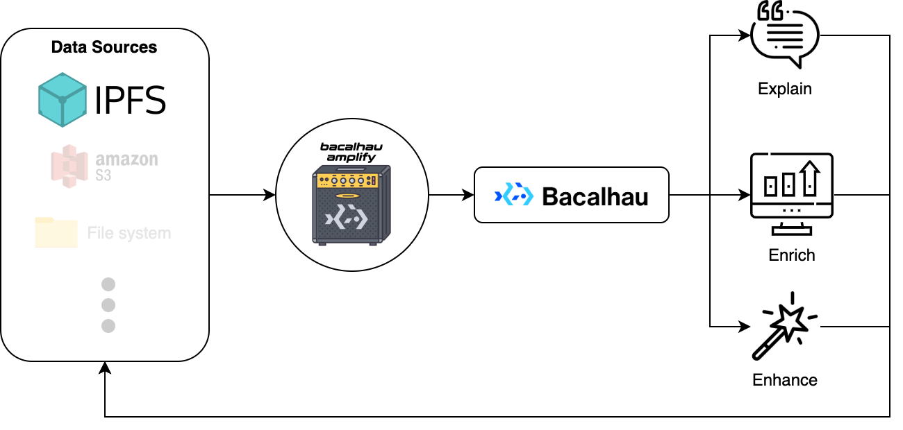

# 🔊 Amplify

Amplify attaches afterburners to your data. Amplify:

* **explain**: metadata extraction, classification, tagging, and reporting
* **erich**: derivative data generation like thumbnails, previews, conversions, etc. 
* **enhance**: batteries-included value-adds like data quality reports, image augmentation, OCR, translations, etc.

Amplify leverages the decentralized compute provided by [Bacalhau](https://bacalhau.org) to magically enrich your data. A built-in suite of pipelines decides what your data is and how to best improve upon it. You can also self-host Amplify to trigger off your offline data sources and implement your own custom pipelines.

       

## Documentation

* User documentation is hosted on the [Bacalhau Docs website](https://docs.bacalhau.org/integration/amplify)
* Developer documentation can be found in the [docs](docs) directory

## Project Status

We decided to bump Amplify to v1 for the Compute over Data Summit 2023 in Boston to signify the following.

We have been running Amplify in production since the beginning of the project. So I suggest that it is stable enough to be ready for developer use. However, development was rapid, so there are edge cases and test coverage is low.

This project was time-boxed and therefore we are no longer actively developing this project. It has not yet been decided whether continue development or enter maintenance mode. If you are interested in further development, please contact the [Bacalhau team on Slack](https://join.slack.com/t/bacalhauproject/shared_invite/zt-1sihp4vxf-TjkbXz6JRQpg2AhetPzYYQ).
