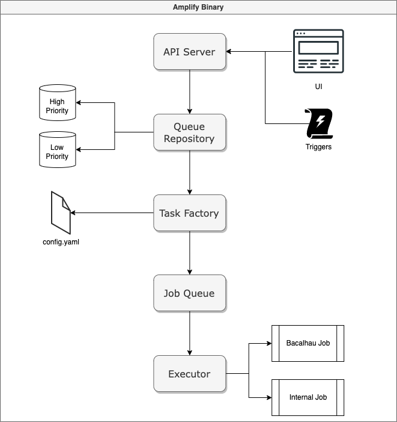

# Developer Documentation

## Testing CIDs

* `QmdpRDxYVnCdvqghj7KfzcaLyqo2NdHcXFriXo3Q7B9SsC` [link](https://gateway.pinata.cloud/ipfs/QmdpRDxYVnCdvqghj7KfzcaLyqo2NdHcXFriXo3Q7B9SsC/) -- the `testdata` directory as of 27/04/2023 -- [Example Result](http://amplify.bacalhau.org/#/queue/193bff74-81b6-4075-a99d-daff216e240b/show)
* `Qmd6fEn5Wgk8LQKouHeBu6vdjL6Ps5ve8zM9iLSopzLz9o` [link](https://gateway.pinata.cloud/ipfs/Qmd6fEn5Wgk8LQKouHeBu6vdjL6Ps5ve8zM9iLSopzLz9o) -- US Consitution blob (text) -- [Example Result (Amplify v0.5.12)](http://amplify.bacalhau.org/#/queue/76e21526-ae31-4feb-a7ea-f4d89bdda3e5/show)
* `QmYMGVfoep9rM82KFWK2BGxznRB7qaPFGfvrqMCJe2juLH` [link](https://gateway.pinata.cloud/ipfs/QmYMGVfoep9rM82KFWK2BGxznRB7qaPFGfvrqMCJe2juLH) -- text excerpts (file with and w/o extension) taken from Wikipedia pages -- [Example Result (Amplify v0.5.12)](http://amplify.bacalhau.org/#/queue/ebf948e4-62eb-425f-895f-317f25a1e3cd/show)
* `QmUN1LF7ZyButvMwVPm1uvgrWiB1FRGbn4CRAEVp5JzZmj` [link](https://gateway.pinata.cloud/ipfs/QmUN1LF7ZyButvMwVPm1uvgrWiB1FRGbn4CRAEVp5JzZmj) -- CSV blob -- [Example Result (Amplify v0.5.12)](http://amplify.bacalhau.org/#/queue/dd6720a1-416d-42d9-b326-b06c0b86e3e7/show)
* `QmNZwDuAkWB8dasQdt3RnaJ434BBwWvFuTPNunWih446dJ` [link](https://gateway.pinata.cloud/ipfs/QmNZwDuAkWB8dasQdt3RnaJ434BBwWvFuTPNunWih446dJ) -- Misc content dir -- [Example Result (Amplify v0.5.12)](http://amplify.bacalhau.org/#/queue/0c18ea58-1e33-49f0-9d8b-01f997604429/show)
* `QmUX8EhBYCdGYVCqa7N6ip1eqRhWtdSB3xy76AGtFgRcas` [link](https://gateway.pinata.cloud/ipfs/QmUX8EhBYCdGYVCqa7N6ip1eqRhWtdSB3xy76AGtFgRcas) -- Image blob -- [Example Result (Amplify v0.5.12)](https://gateway.pinata.cloud/ipfs/QmbpT4eVYhK6sxeZHpSv3grCRGYyExUBWwY437ebydKfT1/)
* `QmbRr4kUXMxQfZPnLUSb1kSMDvFtBUcv1HVSDaAUKe4ePj` [link](https://gateway.pinata.cloud/ipfs/QmbRr4kUXMxQfZPnLUSb1kSMDvFtBUcv1HVSDaAUKe4ePj) -- Image dir -- [Example Result (Amplify v0.5.12)](http://amplify.bacalhau.org/#/queue/4d9bb3ed-0dfb-4c40-82a5-517fdbd545a9/show)
* `QmTjHPpQcDtZ3BpBPN8QuwYMkBgRaPmQknVcFKkc3ickbM` [link](https://gateway.pinata.cloud/ipfs/QmTjHPpQcDtZ3BpBPN8QuwYMkBgRaPmQknVcFKkc3ickbM) -- Video blob -- [Example Result (Amplify v0.5.12)](http://amplify.bacalhau.org/#/queue/12cfb3fe-ff94-4dd2-a13d-bc35791644e8/show)
* `QmPJXMP2qfFMwadWZ1TAuhpXEiEEb7PibDMz5PgpmyVi7B` [link](https://gateway.pinata.cloud/ipfs/QmPJXMP2qfFMwadWZ1TAuhpXEiEEb7PibDMz5PgpmyVi7B) -- Video dir -- [Example Result (Amplify v0.5.12)](http://amplify.bacalhau.org/#/queue/604a5c29-7a07-4aab-90d4-ea57d6e75ced/show)

## Creating a New Release/Deployment

In the CircleCI file there is a job that filters on tags. This builds the binaries, releases the amplify docker container, and runs a `terraform apply` on the production infrastructure.

1. Create a new release tag in the format `vX.X.X`. Increment the version number according to semver.
2. Click the auto-generated release notes. Click the `Set this as latest` button.
3. Publish release.

After the pipeline finishes you can visit [the website](http://amplify.bacalhau.org) or you can check the version by running:

```
gcloud compute ssh amplify-vm-production-0 -- cat /terraform_node/variables | grep AMPLIFY_VERSION
```

### Developing the Terraform Scripts

You can develop the Terraform scripts by creating tags with a postfix of `-anything`. E.g. `v0.4.2-alpha1`. This won't trigger the main branch's tag filter. But you can change your branch so that it does.

## Job Interface

Jobs are individual units of work that execute in a worker, which is just a 
simple goroutine. You can think of a job being a Bacalhau job, but they could be
anything. The crucial element here is that Amplify needs to chain jobs together
and so we need to define a common interface that all jobs must implement. We
have tried to keep this interface as generic as possible, but we must work
within the constraints of the Bacalhau API.

### Definition of a Job

> Note that the definition of a job is quite generic in the code, but for now
> we expect jobs to be 
> [Bacalhau Docker jobs](https://docs.bacalhau.org/getting-started/docker-workload-onboarding)
> , i.e. containers

* The job must be a Bacalhau-like job
* The job must conform to the [input](#job-inputs) and [output](#job-outputs)
  specifications.
* The job must be named and configured to run in the `config.yml` file
* Jobs must have a unique name

### Job Inputs

* All inputs are passed via the `/inputs` directory is mounted as a volume in
  the container
* Jobs must operate on every file and directory in the `/inputs` directory
  recursively
* Previous nodes may be skipped due to a predicate, so don't assume specific inputs will be present

### Job Outputs

* Derivative files must be written to the `/outputs` directory
* Derivative files should have names that are both unique and consistent with 
  the original file name
* Metadata must be written to `stdout` (so subsequent jobs can predicate)
* Errors must be written to `stderr`
* Jobs should refrain from breaking changes to the output directory

## Workflow Interface

Workflows are a collection of jobs that are chained together into a DAG. Amplify
workflows are defined in a YAML file, which is then parsed and executed by the
Amplify engine.

The interesting thing about Amplify workflows is that they run only when they
predicate the results of the previous job. This means that we can define a
workflow that only runs on specific types of data (images, for example).

### Definition of a Workflow

* Workflows must be configured in the `config.yml` file
* Workflows can be duplicated
* Workflows must have a unique name
* Given a single root CID, a composite CID will be generated with the results of
  all workflows

## Amplify Architecture

The image below shows a simplified version of the Amplify architecture.


